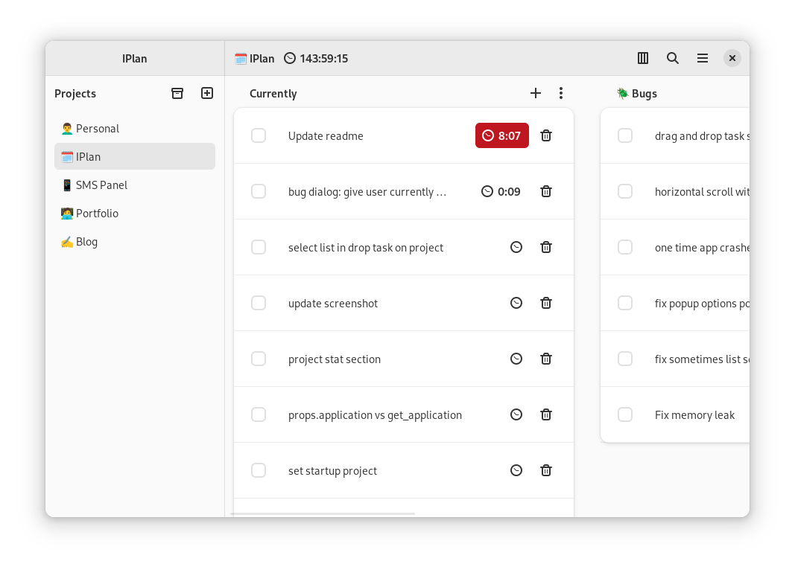

# IPlan

Your plan for improving personal life and workflow

<div align="center">
  
</div>

## Features

- Grouping tasks with project and list
- Timer for tasks
- Global search
- Arranging projects, lists and tasks by drag and drop

## Build

### Gnome Builder

1. Clone the repo

```sh
git clone https://github.com/iman-salmani/iplan.git
```

2. Open project with Gnome Builder
3. Press the run button

### Manuall

1. Clone the repo and move to project directory

```sh
git clone https://github.com/iman-salmani/iplan.git && cd iplan
```

2. Install flatpak builder (flatpak-builder package available in most distributions)

- Fedora

```sh
sudo dnf install flatpak-builder
```

- Ubuntu and Debian based distributions

```sh
sudo apt install flatpak-builder
```

- Arch

```sh
sudo pacman -S flatpak-builder
```

4. Install dependencies

```sh
flatpak install runtime/org.gnome.Sdk/x86_64/43 runtime/org.freedesktop.Sdk.Extension.rust-stable/x86_64/22.08 runtime/org.gnome.Platform/x86_64/43
```

3. Build and install with flatpak builder

- System wide (Recommended)

```sh
sudo flatpak-builder --install builddir ir.imansalmani.IPlan.json --force-clean
```

- User (For testing)

```sh
flatpak-builder --install builddir ir.imansalmani.IPlan.json --force-clean --user
```

4. Run
   > App should be appear in your applications menu.

```sh
flatpak run ir.imansalmani.IPlan
```
